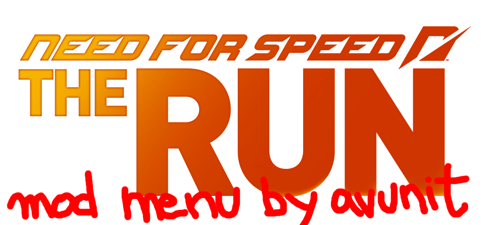

<p align="center">
  
</p>

<p align="center">
  <a href="https://www.python.org/downloads/"></a>
  <a href="https://github.com/avunit1/nfstr/stargazers"></a>
  <a href="https://github.com/avunit1/nfstr/network/members"></a>
  <a href="https://github.com/avunit1/nfstr/releases/latest"></a>
  <a href="LICENSE"></a>
</p>

## What is this?

**NFSTR** is a mod menu for **Need for Speed: The Run** (2011). It's a small Windows app that sits alongside the running game and lets you flip gameplay options on and off from a friendly window instead of editing memory by hand — things like fixing a couple of known crash points, unlocking every vehicle and Challenge Series event, adjusting traffic and AI, and swapping your car mid-run.

If you've never used a tool like this before: NFSTR attaches to the game's process while it's running (the same general idea as Cheat Engine) and safely pokes specific, pre-mapped memory values. It does **not** modify your game files, and it only works while both NFSTR and the game are open at the same time — closing NFSTR (or the game) reverts everything to normal.

This is a single-player, offline tool. It is not built for and should not be used with any online/leaderboard-connected mode.

## Feature list

### Performance
- Unlock the gameplay framerate cap (removes the 30fps lock)

### Crash Fixes
- Fix the Tunnel of Pain / Coastal Rush stage crash ⚠️ *see [Warnings](#warnings--features-that-need-extra-care)*
- Fix the Chicago Interstate action-level crash (two-part patch)

### Timers
- Disable the per-checkpoint countdown timer ⚠️ *see [Warnings](#warnings--features-that-need-extra-care)*
- Disable the out-of-bounds reset timer
- Disable wrong-way respawn
- Disable the "rival getting away" fail timer

### Assists
- Disable all vehicle assists (drift-correction forces, Align-to-Road, Override Drift Intent, Race Line Assist calculation/forces, Drift Intents)
- Enhanced drift physics (alternate physics code path)
- Force Race Line Assist status off

### UI
- Show hidden UI options / unlock the full vehicle list gate
- HUD visibility toggle

### Game
- Unlock all vehicles
- Unlock all Challenge Series events
- Remove vehicle-to-event restrictions

### Vehicle
- Force blown-tire flag
- Force blown-engine flag
- Adjust the vehicle damage / part-detach threshold
- Swap your current car live, from a searchable list of 2,000+ vehicle entries

### Traffic
- Traffic density scale, max density, and vehicle limit — all adjustable

### AI / Race Setup
- Force AI difficulty
- Force-enable AI in events that default to none
- Override number of opponents
- Set your starting grid position
- Difficulty scalar and glue (traction) scalar — both adjustable

### World
- Time of Day override for Career / Challenge Series

### Quality of life
- Auto-attach to the game as soon as it launches, with live "waiting for game…" status
- Per-build calibration and caching, so the same game build attaches instantly on every later launch
- Dark / darker theme, reduced-motion mode
- Remembers window size and last-selected category between sessions
- Favorite vehicles for quick access in the vehicle swap list
- A Developer tab with attach diagnostics, a live session log, and one-click "copy diagnostics"

## Warnings — features that need extra care

- **Disable checkpoint timer** — this doesn't just stop the countdown. It also freezes the distance-to-finish and stage-leader-timer HUD, and breaks overtake / "clean pass" detection, for the rest of that run. This is inherent to the underlying patch, not a bug — there's currently no way to disable only the timer without those side effects.
- **Fix: Tunnel of Pain crash** — enabling this has been confirmed, through direct testing, to corrupt checkpoint-crossing, the distance/timer HUD, and overtake detection for the rest of the run, in both standard and battle races. It's not scoped to just the one stage it's named after. NFSTR shows an explicit confirmation prompt before turning this on — only enable it if you're specifically trying to get past that crash and are prepared for those side effects.
- Anything under **AI / Race Setup**, **Traffic**, and **Vehicle** writes numeric values directly with no bounds-checking beyond what's noted per-feature (e.g. some events break if the opponent count is pushed too high). Start from the defaults and adjust in small steps.
- As with any memory-editing tool, only run NFSTR against your own legitimately-owned copy of the game, and only in single-player/offline play.

## Setup

### Option A — download the latest release (recommended for most people)

1. Go to the [Releases page](https://github.com/avunit1/nfstr/releases/latest) and download `nfstr-v{version}.exe`.
2. Put it anywhere you like — it's a single portable file.
3. Launch **Need for Speed: The Run** first, then run `nfstr-v{version}.exe`.
4. The exe will prompt for Administrator privileges automatically (this is required — reading another process's memory needs it). Accept the prompt.
5. NFSTR auto-attaches and calibrates against your game build the first time; every launch after that is instant.

### Option B — run from source

Requirements: Windows, Python 3.11+.

```bash
git clone https://github.com/avunit1/nfstr.git
cd nfstr
pip install -r requirements.txt
python main.py
```

Same as the release build: start the game first, then run `main.py` from an elevated (Run as administrator) terminal so it can attach successfully.

Settings are saved to `%APPDATA%\nfstr_data\settings.json`, and session logs are written to `%APPDATA%\nfstr_data\logs\session.log` — the same locations whether you're running from source or the built exe.

## Advanced: architecture overview

NFSTR is organized into three layers:

- **`core/`** — the memory-editing engine. Attaches to the game process by name (`core/process.py`), scans for and verifies byte signatures (`core/scanner.py`, `core/resolver.py`), builds small "code caves" for patches that need injected assembly rather than a simple byte overwrite (`core/codecave.py`, `core/jcc.py`), performs the actual reads/writes safely (`core/memory.py`), and caches a verified build's resolved addresses so future launches skip re-scanning (`core/cache.py`). None of this layer knows anything about the UI.
- **`features/engine.py`** — sits between `core/` and the UI. Reads `data/signatures.json` (the catalog of every patch: id, category, patch type, address, verification bytes, risk level) and exposes a simple enable/disable/toggle interface per feature, independent of how it's presented.
- **`ui/`** — the PySide6 front end: sidebar navigation, per-feature toggle rows, the vehicle browser/swap view, settings panel, developer/diagnostics panel, toasts, and tooltips. This layer only calls into `features/engine.py` — it never touches `core/` directly.

`data/` holds the static catalog the app ships with (`signatures.json`, the searchable `vehicles.json` vehicle list, and the raw CSV it was built from). `tools/` holds standalone scripts used to *generate* that catalog (`build_signatures.py`, `build_vehicles.py`) and to calibrate against a new game build from the command line (`calibrate.py`) — none of these three run as part of the normal app, only when maintaining the catalog itself.

## Not yet implemented / known issues

**Not yet implemented**
- `debug_fast_boot` — a planned developer-only option to skip the game's intro/boot sequence during repeated attach testing. Not wired up yet.

**Known issues**
- Tooltips are still being refined — wording and positioning on some feature rows are a work in progress.

## Acknowledgements

NFSTR would not exist without **[mRally2](https://github.com/mRally2)**. The original Cheat Engine table for Need for Speed: The Run — every signature, every verified address, every "this one corrupts the HUD if you enable it" lesson learned the hard way — is mRally2's work. This project is, at its core, a friendlier window wrapped around that research. If you find NFSTR useful, the credit for the hard reverse-engineering part belongs there, not here.

Thank you as well to everyone who tested early builds against game updates and reported back which signatures broke and which didn't — that kind of feedback is the only reason the calibration cache is trustworthy across builds.

Reference material, source data exports, and supporting resources used while building this project are collected in [`/resources`](https://github.com/avunit1/nfstr/tree/main/resources) — worth a look if you want to understand where a specific value or address came from, or if you're extending the signature catalog yourself.

## License

MIT License

Copyright (c) 2026 avunit1

Permission is hereby granted, free of charge, to any person obtaining a copy
of this software and associated documentation files (the "Software"), to deal
in the Software without restriction, including without limitation the rights
to use, copy, modify, merge, publish, distribute, sublicense, and/or sell
copies of the Software, and to permit persons to whom the Software is
furnished to do so, subject to the following conditions:

The above copyright notice and this permission notice shall be included in all
copies or substantial portions of the Software.

THE SOFTWARE IS PROVIDED "AS IS", WITHOUT WARRANTY OF ANY KIND, EXPRESS OR
IMPLIED, INCLUDING BUT NOT LIMITED TO THE WARRANTIES OF MERCHANTABILITY,
FITNESS FOR A PARTICULAR PURPOSE AND NONINFRINGEMENT. IN NO EVENT SHALL THE
AUTHORS OR COPYRIGHT HOLDERS BE LIABLE FOR ANY CLAIM, DAMAGES OR OTHER
LIABILITY, WHETHER IN AN ACTION OF CONTRACT, TORT OR OTHERWISE, ARISING FROM,
OUT OF OR IN CONNECTION WITH THE SOFTWARE OR THE USE OR OTHER DEALINGS IN THE
SOFTWARE.
